# Yalla Bite — Delicious Food, Delivered Fresh

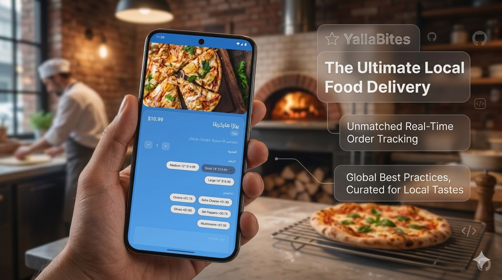

**Yalla Bite** is a full-featured food ordering platform that connects customers with their favorite restaurants through a seamless, modern mobile experience. Available in English and Arabic.

> "Yalla Bite is your go-to app for ordering delicious food from your favorite restaurants. Fresh, fast, and convenient."

## Features

### For Customers

- **Browse & Discover** — Explore menus by category, view special offers, and discover popular items
- **Smart Search** — Find your favorite dishes instantly
- **Customize Your Meal** — Select sizes, add modifiers, and include special notes
- **Real-Time Cart** — Review items, apply promo codes, and see your total before checkout
- **Multiple Payment Options** — Cash on delivery, card, Google Pay, or Apple Pay
- **Order Tracking** — Follow your order from the kitchen to the doorstep
- **Favorites** — Save your go-to items for quick reordering
- **Push Notifications** — Get alerted to order status updates and promotions

### For Drivers

- **View Available Orders** — See nearby delivery requests
- **Accept & Deliver** — One-tap acceptance with integrated Google Maps navigation
- **Order History** — Track completed deliveries and earnings

### For Admins

- **Dashboard** — Centralized control panel
- **Reports & Analytics** — Visual insights with interactive charts (revenue trends, order breakdowns, top-selling items)
- **Manage Branches** — Add, edit, and organize restaurant locations
- **Manage Accounts** — Create and manage customer, driver, and admin accounts
- **Manage Menu** — Full CRUD on categories, menu items, sizes, and modifiers
- **Manage Promotions** — Create offers and promo codes with discount percentages
- **Send Notifications** — Broadcast push notifications to all users or filter by role
- **Notification History** — View all previously sent notifications

## Why Yalla Bite?

| | |
|---|---|
| 🚀 **Fast** | Optimized for quick loading and smooth navigation |
| 🌙 **Dark Mode** | Easy on the eyes, day or night |
| 🔐 **Secure** | Biometric login + secure token storage |
| 🌍 **Bilingual** | Full English and Arabic support |
| 🎨 **Beautiful UI** | Modern glassmorphism design with smooth animations |
| 📊 **Analytics** | Interactive charts for revenue, orders, and sales insights |
| 📱 **Cross-Platform** | Native performance on both iOS and Android |

## Screenshots

  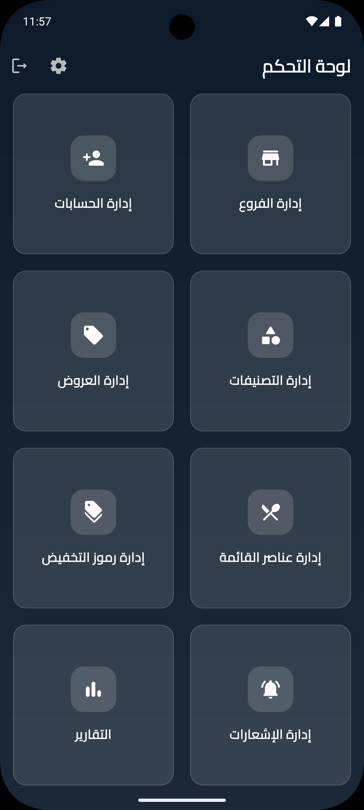
  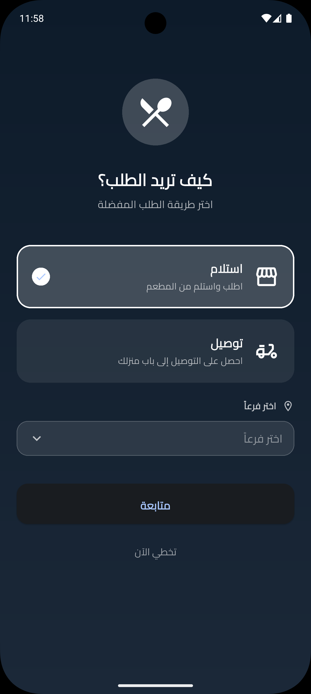
  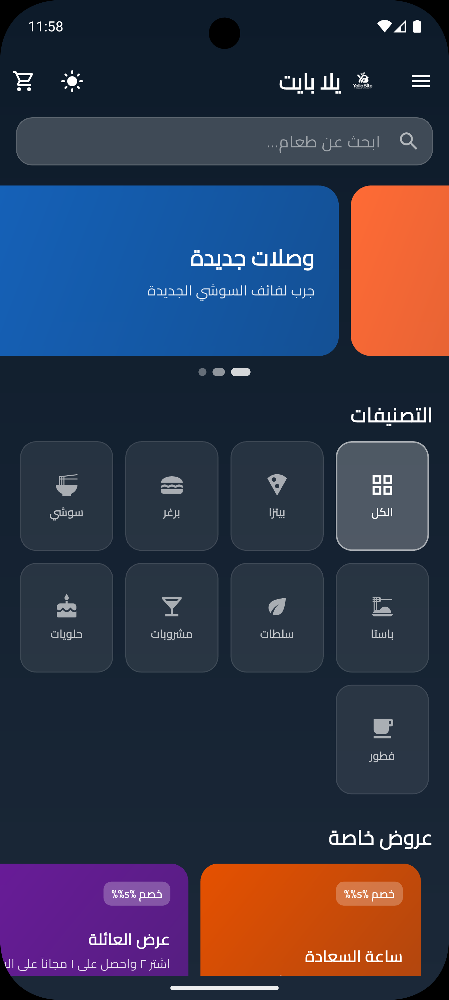
  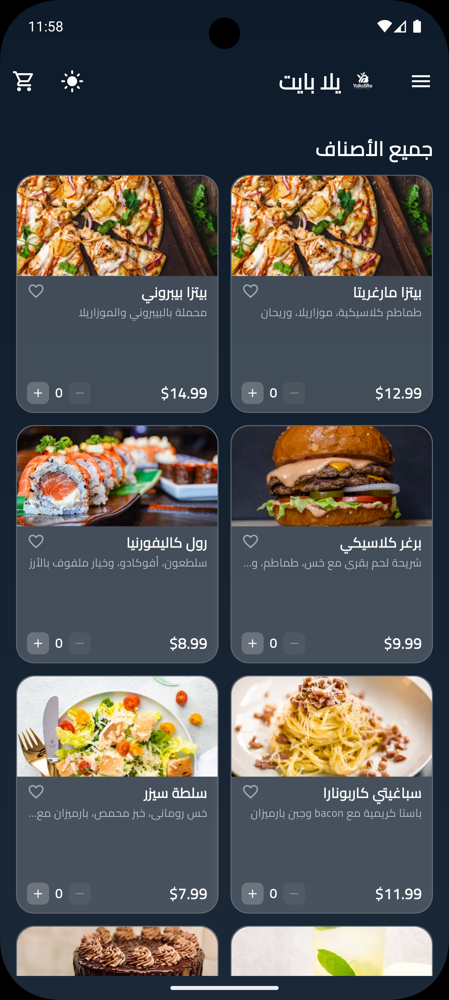
  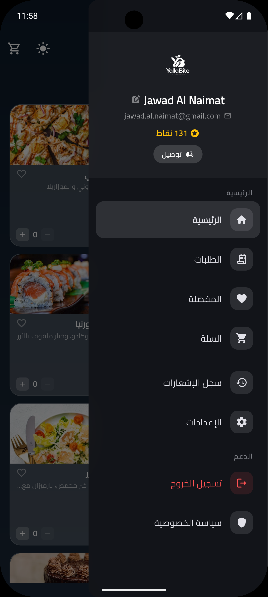
  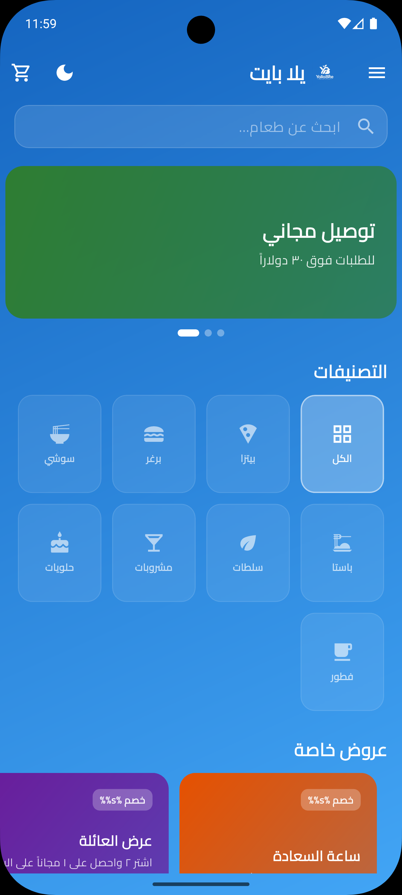
  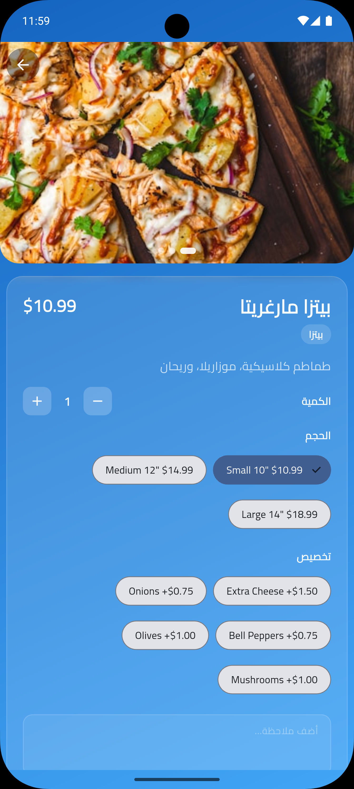
  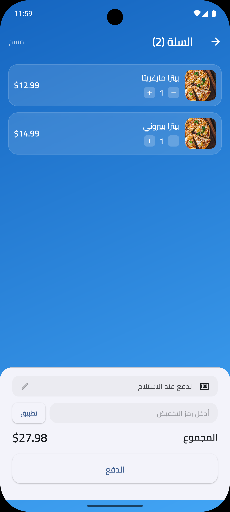
  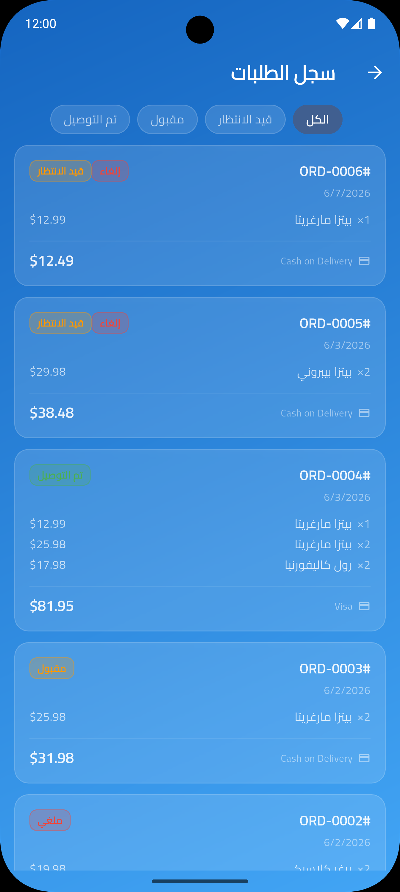
  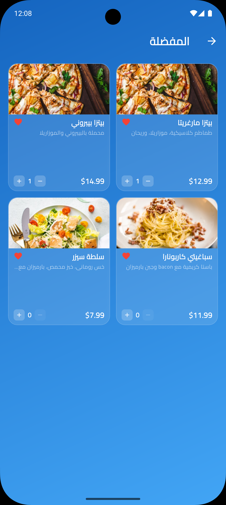
  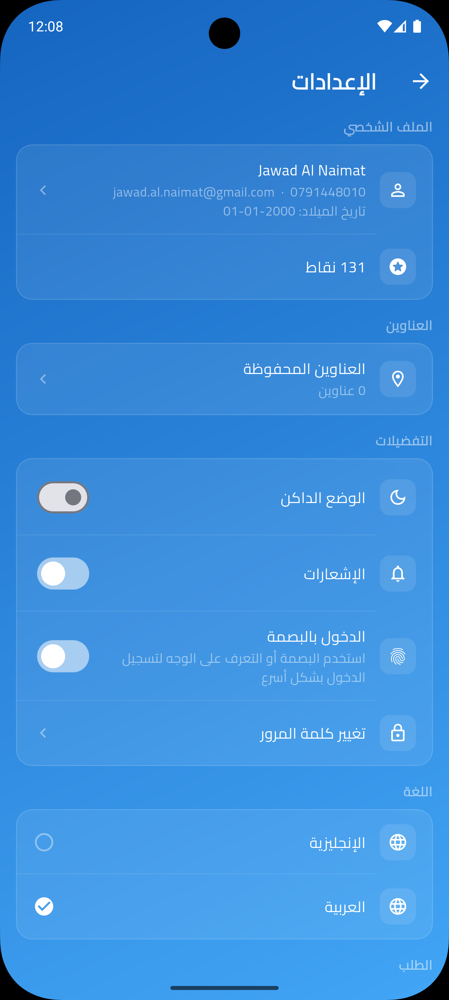

## Supported Platforms

| Platform | Status |
|---|---|
| Android | ✅ |
| iOS | ✅ |

## Download

Coming soon to the App Store and Google Play.

## Contact

- **Developer**: Jawad Al Naimat
- **Mobile Number**: +962 79 1448010
- **Support**: jawad.al.naimat@gmail.com

---
